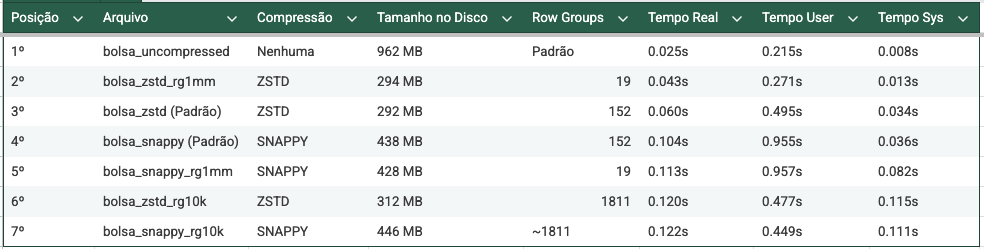

# Exploração de Arquivos Parquet com DuckDB
- Author: Prof. Barbosa  
- Contact: infobarbosa@gmail.com  
- Github: [infobarbosa](https://github.com/infobarbosa)

## 1. Objetivo

- Explorar arquivos Parquet usando DuckDB
- Comparar tamanho dos arquivos no disco
- Comparar performance de algoritmos de compressão vs I/O bruto
- Compreender o impacto do tamanho dos *Row Groups* em consultas

## 2. Setup do Ambiente (Via Docker)

Para garantir um ambiente isolado e padronizado, este laboratório utiliza Docker. Implementaremos uma arquitetura de dados separando a camada bruta (Raw) do seu diretório de trabalho.

### 2.A. Preparando os Diretórios

No terminal do seu computador (Linux/macOS), crie a estrutura de pastas:

```bash
mkdir data
mkdir workspace
```

### 2.B. Baixando a Base de Dados (Camada Raw)

A base do Bolsa Família de Abril/2026 está disponível no Portal da Transparência [aqui](https://portaldatransparencia.gov.br/download-de-dados/novo-bolsa-familia/202604).

Baixe o arquivo `.zip` e mova-o para a pasta `data/`. Em seguida, descompacte-o:

```bash
cd data/
unzip 202604_NovoBolsaFamilia.zip
cd ..
```

### 2.C. Construindo e Iniciando o Container

Construa a imagem Docker. O arquivo `Dockerfile` já instalará o DuckDB e o utilitário `parquet-tools`.

```bash
docker build -t lab-parquet .
```

Agora, inicie o container mapeando os diretórios. A pasta `data` será montada como somente-leitura (`:ro`) para proteger os dados brutos, enquanto a pasta `workspace` será o seu diretório de trabalho.

```bash
docker run -it -v $(pwd)/data:/data:ro -v $(pwd)/workspace:/workspace lab-parquet
```

Você agora está dentro do container, no diretório `/workspace`.

## 3. Preparação dos Dados (Limpeza em Tempo Real)

Inicie o DuckDB no terminal do container digitando o comando abaixo:

```bash
duckdb
```

Para não termos que reescrever o CSV inteiro em disco, vamos fazer o cast dos dados diretamente no DuckDB usando uma *Common Table Expression* (CTE) ou subquery. Note que em todas as queries a seguir, utilizaremos um `REPLACE` combinado com um `CAST` para converter o campo "VALOR PARCELA" (que contém vírgulas) para o tipo `DECIMAL(10,2)`.

Habilite o timer no DuckDB para analisar o tempo de execução no console:

```sql
.timer on
```

Opcional: Se desejar testar apenas a capacidade de I/O em processamento único, sem paralelismo:

```sql
SET threads = 1; 
```

---

## 4. Criando a Matriz de Cenários

Vamos criar **7 versões** do mesmo arquivo para testar cruzamentos entre algoritmos de compressão (Uncompressed, ZSTD, Snappy) e tamanhos de blocos (*Row Groups*). Execute as queries abaixo no CLI do DuckDB. 
*Nota: estamos lendo o CSV da pasta mapeada de leitura (`/data/`), mas os arquivos Parquet serão gravados automaticamente no diretório atual (`/workspace/`).*

**1. Sem Compressão (O Gargalo Físico)**
Desabilitando a compressão para expor o custo puro de I/O de disco.
```sql
COPY (
    SELECT *, CAST(REPLACE("VALOR PARCELA", ',', '.') AS DECIMAL(10,2)) AS VALOR_NUMERICO
    FROM read_csv('/data/202604_NovoBolsaFamilia.csv', encoding='latin-1', delim=';')
) TO 'bolsa_uncompressed.parquet' (FORMAT PARQUET, COMPRESSION 'UNCOMPRESSED');
```

**2. Compressão ZSTD Padrão**
O DuckDB utiliza ZSTD com Row Groups de 122.880 linhas por padrão, oferecendo altíssima compressão.
```sql
COPY (
    SELECT *, CAST(REPLACE("VALOR PARCELA", ',', '.') AS DECIMAL(10,2)) AS VALOR_NUMERICO
    FROM read_csv('/data/202604_NovoBolsaFamilia.csv', encoding='latin-1', delim=';')
) TO 'bolsa_zstd.parquet' (FORMAT PARQUET, COMPRESSION 'ZSTD');
```

**3. Compressão Snappy Padrão**
O Snappy comprime menos do que o ZSTD (arquivo maior), mas exige menos ciclos de CPU na descompressão.
```sql
COPY (
    SELECT *, CAST(REPLACE("VALOR PARCELA", ',', '.') AS DECIMAL(10,2)) AS VALOR_NUMERICO
    FROM read_csv('/data/202604_NovoBolsaFamilia.csv', encoding='latin-1', delim=';')
) TO 'bolsa_snappy.parquet' (FORMAT PARQUET, COMPRESSION 'SNAPPY');
```

**4. ZSTD com Row Groups Minúsculos (10k linhas)**
Isso aumenta consideravelmente a proporção de metadados no arquivo, gerando um *footer* substancialmente maior.
```sql
COPY (
    SELECT *, CAST(REPLACE("VALOR PARCELA", ',', '.') AS DECIMAL(10,2)) AS VALOR_NUMERICO
    FROM read_csv('/data/202604_NovoBolsaFamilia.csv', encoding='latin-1', delim=';')
) TO 'bolsa_zstd_rg10k.parquet' (FORMAT PARQUET, COMPRESSION 'ZSTD', ROW_GROUP_SIZE 10000);
```

**5. ZSTD com Row Groups Gigantes (1 Milhão de linhas)**
Otimizado para leituras completas (*Full Scans*), mas penaliza filtros extremamente granulares.
```sql
COPY (
    SELECT *, CAST(REPLACE("VALOR PARCELA", ',', '.') AS DECIMAL(10,2)) AS VALOR_NUMERICO
    FROM read_csv('/data/202604_NovoBolsaFamilia.csv', encoding='latin-1', delim=';')
) TO 'bolsa_zstd_rg1mm.parquet' (FORMAT PARQUET, COMPRESSION 'ZSTD', ROW_GROUP_SIZE 1000000);
```

**6. Snappy com Row Groups Minúsculos (10k linhas)**
```sql
COPY (
    SELECT *, CAST(REPLACE("VALOR PARCELA", ',', '.') AS DECIMAL(10,2)) AS VALOR_NUMERICO
    FROM read_csv('/data/202604_NovoBolsaFamilia.csv', encoding='latin-1', delim=';')
) TO 'bolsa_snappy_rg10k.parquet' (FORMAT PARQUET, COMPRESSION 'SNAPPY', ROW_GROUP_SIZE 10000);
```

**7. Snappy com Row Groups Gigantes (1 Milhão de linhas)**
```sql
COPY (
    SELECT *, CAST(REPLACE("VALOR PARCELA", ',', '.') AS DECIMAL(10,2)) AS VALOR_NUMERICO
    FROM read_csv('/data/202604_NovoBolsaFamilia.csv', encoding='latin-1', delim=';')
) TO 'bolsa_snappy_rg1mm.parquet' (FORMAT PARQUET, COMPRESSION 'SNAPPY', ROW_GROUP_SIZE 1000000);
```

---

## 5. Teste de I/O e Storage (Terminal do Sistema Operacional)

Saia do CLI do DuckDB para voltar ao terminal do container executando:

```sql
.exit
```

Vamos analisar os arquivos gerados no nível do sistema operacional (dentro de `/workspace`).

Compare o peso de todos os arquivos:

```bash
ls -lh bolsa_*.parquet
```

Utilize o `parquet-tools` (já embutido no container) para provar as partições internas (quantidade de *Row Groups*) alocadas:

```bash
parquet-tools inspect bolsa_zstd.parquet | grep "num_row_groups:"
```

```bash
parquet-tools inspect bolsa_zstd_rg10k.parquet | grep "num_row_groups:"
```

```bash
parquet-tools inspect bolsa_zstd_rg1mm.parquet | grep "num_row_groups:"
```

**Análise Técnica:** O arquivo `bolsa_uncompressed.parquet` será massivamente maior que todos os outros. Entre os arquivos compactados, os que possuem a marcação `rg10k` tendem a ser ligeiramente maiores em disco do que suas contrapartes normais e `rg1mm` devido à explosão de blocos de metadados no rodapé. Da mesma forma, os arquivos formatados com `snappy` serão maiores que os formatados com `zstd`.

---

## 6. Teste de Performance (No DuckDB)

Inicie o DuckDB novamente no terminal do container:

```bash
duckdb
```

Habilite o timer para os testes de stress:

```sql
.timer on
```

**Cenário A: O Paradoxo da Compressão (Full Scan em Coluna)**
O banco varrerá apenas a coluna de valores em todo o arquivo. Compare o tempo de execução entre carregar os dados brutos de disco vs descomprimir na CPU.

```sql
SELECT UF, SUM(VALOR_NUMERICO) FROM 'bolsa_uncompressed.parquet' GROUP BY UF;
```

```sql
SELECT UF, SUM(VALOR_NUMERICO) FROM 'bolsa_zstd.parquet' GROUP BY UF;
```

```sql
SELECT UF, SUM(VALOR_NUMERICO) FROM 'bolsa_snappy.parquet' GROUP BY UF;
```

*Análise Técnica:* É muito comum que a execução no arquivo `uncompressed` seja significativamente **mais lenta**, mesmo não gastando CPU com descompressão. Isso prova que o I/O de disco é o maior gargalo no Big Data, justificando o uso de tecnologias como ZSTD e Snappy para trafegar menos dados físicos.

**Cenário B: O Filtro Empurrado (Predicate Pushdown)**
Vamos testar a estatística de metadados buscando por um estado específico em um arquivo com blocos imensos.

```sql
SELECT "NOME FAVORECIDO", VALOR_NUMERICO 
FROM 'bolsa_zstd_rg1mm.parquet' 
WHERE UF = 'AC';
```

*Análise Técnica:* O mecanismo de consulta lerá o rodapé do arquivo, verificará os valores mínimos e máximos da coluna `UF` por *Row Group* e descartará a leitura completa de blocos que não possuam dados do Acre. 

**Cenário C: Sobrecarga em Buscas Pontuais (Point Lookups)**
Vamos buscar um registro isolado, pedindo que o banco traga `SELECT *`. Note os arquivos usados: compare o arquivo com blocos minúsculos vs blocos gigantes.

```sql
SELECT * FROM 'bolsa_zstd_rg10k.parquet' 
WHERE "NIS FAVORECIDO" = 16250240692; -- Use um NIS válido da sua base
```

```sql
SELECT * FROM 'bolsa_zstd_rg1mm.parquet' 
WHERE "NIS FAVORECIDO" = 16250240692;
```

*Análise Técnica:* O formato colunar não é feito para retornar todas as colunas de uma única linha. O motor precisa encontrar a linha através das colunas individuais e depois materializar o registro juntando fisicamente os valores. Aqui, o arquivo `rg10k` pode performar melhor que o `rg1mm`, pois o bloco a ser descomprimido para encontrar o NIS e extrair as demais colunas é 100 vezes menor.

---



## 7. Inspeção do Plano de Execução (EXPLAIN ANALYZE)

Para comprovar fisicamente a eficiência do *Predicate Pushdown* (Filtro Empurrado), vamos inspecionar a árvore de execução gerada pelo banco de dados.

Com o DuckDB aberto, utilize o comando `EXPLAIN ANALYZE` antes da query do cenário B:

```sql
EXPLAIN ANALYZE 
SELECT "NOME FAVORECIDO", VALOR_NUMERICO 
FROM 'bolsa_zstd_rg1mm.parquet' 
WHERE UF = 'AC';
```

**Análise do Plano de Execução:**
Na saída gerada no console, observe a estrutura de árvore, com atenção especial ao nó `PARQUET_SCAN`. 

Analise as métricas de leitura apresentadas neste nó. Ele demonstrará de forma mensurável que o motor computacional leu os metadados do arquivo e utilizou as estatísticas de mínimo e máximo da coluna `UF` para ignorar completamente (*skip*) a leitura física dos blocos que não continham o estado do Acre. Isso prova matematicamente a economia substancial de I/O na consulta.

---

## Parabéns! 
Você aprendeu a analisar o formato Parquet de forma técnica, medindo o impacto real de diferentes configurações no sistema.
